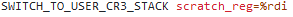

# Linux kernel securities overview

## Abstract

This article provides a concise overview of key security measures in the Linux kernel, with a focus on Intel x86-64 architecture. Exploring conventional security mechanisms such as Kernel Address Space Layout Randomization (KASLR), Kernel Stack-Canary, Supervisor Mode Access/Execution Prevention, and Kernel Page Table Isolation, the article outlines their functionality and potential vulnerabilities.

## Content

- [Linux kernel securities overview](#linux-kernel-securities-overview)
  - [Abstract](#abstract)
  - [Content](#content)
  - [Introduction](#introduction)
  - [Conventional securities](#conventional-securities)
    - [Kernel Address Space Layout Randomization (KASLR)](#kernel-address-space-layout-randomization-kaslr)
      - [How it works ?](#how-it-works-)
      - [How to break it ?](#how-to-break-it-)
    - [Kernel stack-canary](#kernel-stack-canary)
      - [How it works ?](#how-it-works--1)
      - [How to break it ?](#how-to-break-it--1)
    - [Supervisor Mode (Access\|Execution) Prevention](#supervisor-mode-accessexecution-prevention)
      - [How it works ?](#how-it-works--2)
      - [How to break it ?](#how-to-break-it--2)
    - [Kernel Page Table Isolation](#kernel-page-table-isolation)
      - [How it works ?](#how-it-works--3)
      - [How to break it ?](#how-to-break-it--3)
  - [Conclusion](#conclusion)

## Introduction

The Linux kernel is arguably the most widely used kernel globally, particularly prevalent in server contexts where it operates with elevated privileges. Given its critical role, ensuring the security of Linux kernel systems is paramount. This blog post aims to summarize the most crucial mitigations for kernel security and bypass methods for an attacker. These security measures can be categorized into two groups: those applicable to conventional software and those specifically reserved for the kernel domain. The scope of this blogpost is the Linux kernel, only running on Intel x86-64 computers.

## Conventional securities

### Kernel Address Space Layout Randomization (KASLR)

#### How it works ?

ASLR (Address Space Layout Randomization) involves randomizing the base address of certain segments during the execution of classical software. In this context, addresses for the stack, libraries, and heap are randomized with each execution. KASLR (Kernel Address Space Layout Randomization) functions similarly, but it is specifically applied to the kernel. With each boot, ASLR is applied on the kernel, ensuring a randomized address space for enhanced security. More technically, the ASLR is applied during the following chain : 

- [Select kernel region to randomize](https://github.com/torvalds/linux/blob/88035e5694a86a7167d490bb95e9df97a9bb162b/arch/x86/mm/kaslr.c#L48)

- [Init a PRNG (pseudo-random number generator)](https://github.com/torvalds/linux/blob/88035e5694a86a7167d490bb95e9df97a9bb162b/arch/x86/mm/kaslr.c#L116)

- [Randomize](https://github.com/torvalds/linux/blob/88035e5694a86a7167d490bb95e9df97a9bb162b/arch/x86/mm/kaslr.c#L129)

#### How to break it ?

The method to "bypass" this mitigation is analogous to the user-land scenario: a leak is essential. Without a leak, predicting the base address becomes impractical.

### Kernel stack-canary

#### How it works ?

The widely recognized stack canary is a value placed between the stack variables and the saved return address. Essentially, if this value is overwritten, the program crashes to prevent any exploitation. In the context of the kernel, the concept remains the same, but the program that crashes is the kernel itself. The following table illustrates the concept.

|                      |
|----------------------|
| DATA                 |
| saved RIP            |
| canary               |
| function stack frame |

In the kernel codebase, we can find how the cookie is implemented through the following pieces of code :

- [Avoid stack overflow from functions regarding zero terminated buffers](https://github.com/torvalds/linux/blob/88035e5694a86a7167d490bb95e9df97a9bb162b/include/linux/stackprotector.h#L10)

- [Init stack cookie value](https://github.com/torvalds/linux/blob/88035e5694a86a7167d490bb95e9df97a9bb162b/arch/x86/include/asm/stackprotector.h#L50)

#### How to break it ?

Once again, to circumvent this mitigation, it is necessary to exploit a data leak.

### Supervisor Mode (Access|Execution) Prevention

#### How it works ?

SMAP (Supervisor Mode Access Prevention) is a security feature executed with elevated privileges, such as ring 0, to prevent reading or writing to pages marked with lower privileges, such as ring 3. Technically, it utilizes a bit in the CR4 register and the page tables to manage the activation of this security measure and the privileges assigned to the pages. SMEP is the same, but for execution. One more time, we can find this mitigation here in the kernel codebase:

- [Activate the CR4 SMEP bit](https://github.com/torvalds/linux/blob/0dd3ee31125508cd67f7e7172247f05b7fd1753a/arch/x86/kernel/cpu/common.c#L353C30-L353C30)

- [Activate the CR4 SMAP bit](https://github.com/torvalds/linux/blob/0dd3ee31125508cd67f7e7172247f05b7fd1753a/arch/x86/kernel/cpu/common.c#L364C30-L364C30)

- [A bunch of functions to deactivate occasionally SMAP](https://github.com/torvalds/linux/blob/0dd3ee31125508cd67f7e7172247f05b7fd1753a/arch/x86/include/asm/smap.h)

#### How to break it ?

To circumvent SMEP (Supervisor Mode Execution Prevention), we can clear the SMEP CR4 bit or refrain from executing code originating from userland pages. For instance, limiting the payload to ROP (Return-Oriented Programming) techniques can be an effective strategy. Similarly, for SMAP (Supervisor Mode Access Prevention), we can also unset it. If no suitable gadget is available, kernel functions can be employed to write to CR4. However, in certain newer kernel releases, it might not be possible to unset specific bits after activation.

### Kernel Page Table Isolation

#### How it works ?

KPTI (Kernel Page-Table Isolation) is a software mitigation that mandates the use of distinct page table sets for kernel mode and user mode. In kernel mode, full access is granted to kernel pages, while user pages are marked as non-executable. In user mode, only specific kernel pages, such as syscall trampoline pages and interruptions, are accessible, and all user pages remain accessible. Originally implemented to safeguard against the Meltdown attack, KPTI enhances security by isolating kernel and user page tables.

#### How to break it ?

To circumvent these security mitigations, two primary strategies can be employed. The simpler approach involves returning to user-land, as in traditional exploitation. Since the page table set is not switched at this point, executing code in user pages will result in an error. By handling this error, the kernel, during the exception process, will swap the page table sets. The second method involves utilizing the code section responsible for transitioning from kernel mode to user mode as a gadget to return.

- [SISEGV method justification](https://github.com/torvalds/linux/blob/0dd3ee31125508cd67f7e7172247f05b7fd1753a/arch/x86/entry/entry_64.S#L599)

## Conclusion

In conclusion, safeguarding the Linux kernel involves a layered approach, employing robust security measures like KASLR, stack canaries, access/execution prevention, and page table isolation. However, the persistent need for addressing potential vulnerabilities, particularly through data leaks, underscores the ongoing challenge of ensuring kernel security in the dynamic landscape of system vulnerabilities.
